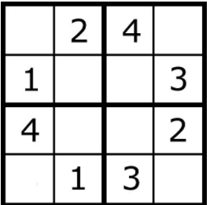
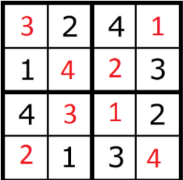
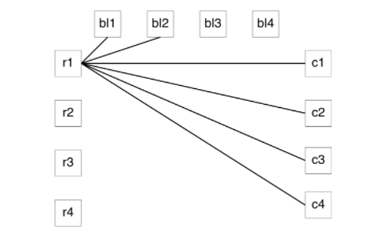

# JavaSudoku

Python Sudoku Framework for a backtracking AI

### Modeling and Solving Sudoku as a CSP

#### Contents
- Introduction	2
- Part 1: Sudoku	3
  - Part 1.1: The Game of Sudoku	3
  - Part 1.2: Creating Sudoku Puzzles	3
  - Part 1.3 Modeling Sudoku using the CSP model	4
- Part 2: Search with Backtracking	6
  - Part 2.1: Using BTSolver	6
  - Part 2.2: The Trail	6
  - Part 2.3: To Do List for BTSolver	6
- Part 3: Local Search	7
  - Part 3.1: Using LocalSolver	7
  - Part 3.2: Components of a local solver	8
  - Part 3.3: Potential Local Search Formulation for Sudoku	8
  - Part 3.4 To Do List for LocalSolver	9
- References	10


#### Introduction

In this project, you will explore various approaches to solving Sudoku as a Constraint Satisfaction Problem in JAVA. Along the way, you will fully flesh out several heuristics for a backtracking solver for Sudoku, and try your hand at local search.
This project hinges on existing code, which provides you with both a backtracking solver and a local search solver for Sudoku. Please unzip the starter code provided and create a new java project using the folder SudokuShell as the project source. You will implement a multitude of heuristics to optimize the performance of the backtracking solver, and allow the local search solver to achieve resolution.
The files that you may need to edit include:

- `Variable.java`
  - represents a variable in the CSP
- `Domain.java`
  - represents the domain of a variable
- `Constraint.java`
  - represents a constraint in the CSP
- `ConstraintNetwork.java`
  - represents the CSP model
- `BTSolver.java`
  - a backtracking solver
- `Trail.java`
  - a trail of assignments that have occurred
- `LocalSolver.java`
  - a local search solver
- `Assignment.java`
  - an assignment of a value to a variable in local search.

All of which are located in the `cspSolver` package.

#### Part 1: Sudoku

This section will introduce the basics of Sudoku as well as how to encode a Sudoku Puzzle to a CSP model.

#### Part 1.1: The Game of Sudoku

Sudoku is a logic based, combinatorial, number placement puzzle. For the purposes of this assignment, the objective of Sudoku is to fill a N x N grid with digits such that each row, column, and p x q blocks contains all the digits from 1 to N, where N represents the number of rows/columns per grid, p represents the number of rows per block/ number of blocks along a row, and q represents the number of columns per block/ number of blocks along a column.

#### Part 1.2: Creating Sudoku Puzzles

After loading the provided code into eclipse navigate to the examples package and open the file SudokuFileExample.java. The example shows two separate ways of creating SudokuFiles.
 `SudokuBoardGenerator.generateBoard(n,p,q,m)`
generates a n x n board with
  - p blocks per row
  - q block per column
  - m initialized values

`SudokuBoardReader.readFile(filename)` generates a board from a file that uses the following format.
  - line 1: `<n> 
 <q>`
  - lines 2 through <n> + 1: a row of Sudoku values as odometer values* separated by spaces

For examples of puzzles using the provided format, go to the folder ExampleSudokuFiles and see the puzzles. Each puzzle provided in this folder is guaranteed to have a solution.

#### Part 1.3 Modeling Sudoku using the CSP model

In this project, the CSP model is depicted using ConstraintNetwork. While the conversion from SudokuFile to a ConstraintNetwork is provided to you, it is important to understand how Sudoku can be modeled as a CSP.

Formally, a CSP can be defined as follows
  - `V={V1,...,Vn}` //set of variables
  - `D={D1,...,Dn}` //set of respective domains of values
  - `C={C1,...,Cx}` //set of constraints

For a 4x4 sudoku puzzle, each `Vi` represents one of the 16 cells and can take on a value from the domain `Di`. Each `Di` initially consists of the values `{1, 2, 3, 4}` and shrinks based on the constraints `{C1, ..., Cx}` where x depends on the scope of a constraint. Each `Cj` consists of `<Sj, Rj>` where `Sj` represents the set of variables participating in the constraint, and `Rj` represents the not-equals constraint over the set of variables.
In the case of the 4x4 Sudoku, the constraints can be either 2-ary, (i.e. the number of elements in each set `Sj` is 2), or the constraints can be 4-ary constraints.

*Odometer format uses alphanumeric symbols 1-9, A-Z to represent the numbers 1-35. Any 0 in the puzzle represents an uninitialized value.*

If each constraint models the relation between every two cells, then the constraints will be 2-ary. This model is represented in `Figure 1c`, where each dot represents a Variable, and each arc between variables represents a constraint containing the connected variables.

![Figure 1c: 2-ary constraints of a 4x4 Sudoku puzzle containing the top left cell [1]](assets/1c.png)

However, if each constraint models a row, column, or block of the 4x4 Sudoku puzzle, then the constraints will be 4-ary. Assuming `{r1,r2,r3,r4}` represent the variables in the rows from top to bottom, `{c1,c2,c3,c4}` represent the variables in the columns from left to right, and `{bl1,bl2,bl3,bl4}` represent the variables in the blocks from top left clockwise to bottom left, the model will be represented by `Figure 1d`.

`ConstraintNetwork.java` allows for both representations of the CSP. Additionally, the `ConverterExample` in the examples package along with the `Converter` in the sudoku package describes how to create the n-ary `ConstraintNetwork` of a n x n Sudoku puzzle.

#### Part 2: Search with Backtracking

In this part of the project, you will implement various heuristics and test their impact on the performance of backtracking search.

#### Part 2.1: Using BTSolver

The `BTSolverExample` in the examples package shows how to run the `BTSolver`. You may want to follow the solver step by step in debug mode for a few iterations in order to get a deeper understanding of how the solver works.

The solve method in `BTSolver` is an implementation of the pseudocode provided for performing `Recursive Backtracking` on page 142 in chapter 5 of the Russell-Norvig AI book. The use of the trail is discusses in the next section.

#### Part 2.2: The Trail

The trail is needed to enable backtracking and is utilized by `BTSolver`. There are three parts to the trail:
  - adding records of variables
  - adding markers
  - undoing changes

Every time a variable has its domain modified, a copy of the variable prior to the modification will be pushed onto the trail. Every time the undo method is called, changes made after the latest marker are undone, and the latest marker is popped.

#### Part 2.3: To Do List for BTSolver

Two improvements onto backtracking search include the introduction of heuristics and the introduction of consistency checks. Heuristics are able to hasten the speed of resolution by checking the most promising assignments first and consistency checks prune the search space, reducing the number of potential assignments to check. This section details the list of heuristics and consistency checks that you must implement.

| Variable Selection Heuristics | description |
| ------------- |:-------------:| -----:|
| Minimum Remaining Value | Select the variable with the fewest remaining values |
|    Degree   | Select the variable involved with the largest number of constraints on other unassigned variables |

| Value Selection Heuristics | description |
| ------------- |:-------------:| -----:|
| Least Constraining Value | Select the value that prunes the least from neighboring domains |

| Consistency Checks | description |
| ------------- |:-------------:| -----:|
| Forward Checking | If X is the variable being assigned, then for each Y such that Y belongs to a constraint with X, prune the domain of Y of any values inconsistent with the assignment to X |
| Arc Consistency | For each pair of variables participating in a constraint with each other: Every value in the second variable’s domain must be satisfiable by at least one value in the first variable’s domain |

#### Part 3: Local Search

`Stochastic Local search` is another method utilized to solve the constraint satisfaction problem as well as other optimization problems. Instead of building a solution an assignment at a time, local search is initialized with a candidate solution and is iteratively improved until the search converges. However, there are no guarantees that the search will converge towards a solution. In this section, you will create attempt to create a local search solver that can converge.

#### Part 3.1: Using LocalSolver

The `LocalSolverExample` in the examples package shows how to run the default local solver. However, if you run it, you will realize that this solver is unable to deliver a solution. This is because the `LocalSolver` generates entirely random moves. It is up to you to figure out how to generate a working `Local Search Solver`. The next sections provide some resources that will help you with that task.

#### Part 3.2: Components of a local solver

A local search solver consists of three components : An initial candidate solution, a successor function, and a heuristic evaluation function. In `LocalSolver`, the initial candidate solution is just a random assignment of 1-N in each of the N^2 squares, the successor randomly changes the value assigned to a variable, and the heuristic evaluation counts the number of variable-constraint violations. The components in `LocalSolver` are extremely inefficient at converging to a solution. Rather, it is extremely unlikely for this solver to create a solution at all. The next section discusses alternate formulations that show promise.

#### Part 3.3: Potential Local Search Formulation for Sudoku

This section will provide examples for creating candidate solutions, successor functions, and heuristic evaluation functions. Additionally, this section will detail different ways to incorporate additional randomness to the solver, which helps avoid the local minima present in the heavily constrained Sudoku puzzle.

| Candidate Solution | description |
| ------------- |:-------------:| -----:|
| Initialize each row, column, OR block as a random ordering of the numbers 1-n | Extremely quick assignment that leverages the structure of a sudoku puzzle to provide a stronger starting point |

| Successor Function | description |
| ------------- |:-------------:| -----:|
| Swap the values of two cells within a row, column, OR block | Keeps the partial all-different constraint  that was set by the candidate solution, while obtaining different values per iteration |
| Min-Conflicts | Selects the most promising value of a randomly selected conflicted variable, i.e. the value that introduces the fewest conflicts |

| Heuristic Evaluation | description |
| ------------- |:-------------:| -----:|
| Sum of conflicts in each constraint | Simple evaluation function. As the heuristic approaches 0, the state more closely resembles a solution |

| Incorporating Randomness | description |
| ------------- |:-------------:| -----:|
| Random Restarts | If the solver cannot improve its heuristic value over a substantial number of trials, restart the solver by initializing a new candidate solution and try again |
| Random Selection | Instead of always choosing the next state provided by the successor function, perform a less optimal change in hopes of avoiding local minima |

#### Part 3.4 To Do for LocalSolver

Modify/rewrite the `LocalSolver` in order to create a stochastic local search solver that can approach convergence. Use the methods from the book (i.e. hill climbing, simulated annealing, etc.) or other methods that you find online to help you create a working local search.

#### References
- [1]	Elizabeth Arnold, Stephen Lucas, and Laura Taalman. Grobner Basis Representations of Sudoku
